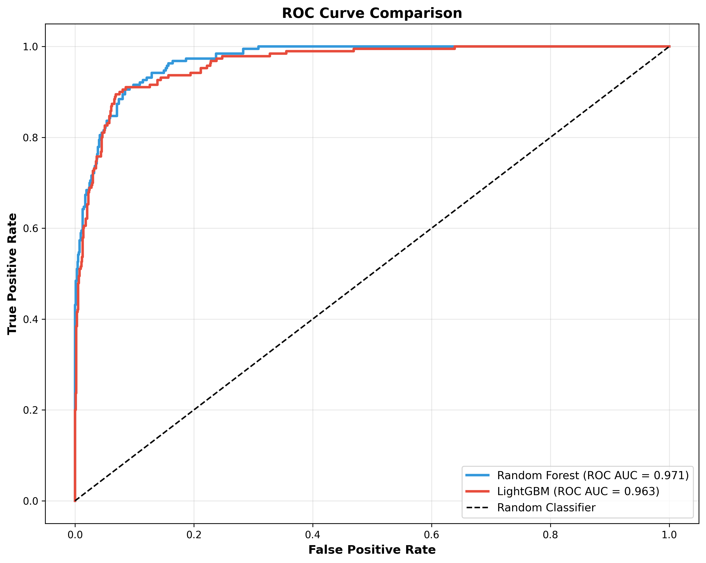

# E-Commerce Customer Churn Prediction

## Project Overview

This project develops a machine learning pipeline to predict customer churn for an e-commerce platform. The objective is to identify customers who are likely to stop using the service so that retention strategies can be implemented proactively.

The project covers:

- Data cleaning and preprocessing
- Missing value treatment
- Feature engineering
- Class imbalance handling using SMOTE
- Model training using Random Forest and LightGBM
- Performance evaluation using multiple classification metrics
- Business-oriented interpretation of results

---

## Results

| Metric | Random Forest | LightGBM |
|----------|----------|----------|
| Accuracy | 0.930 | 0.927 |
| Precision | 0.803 | 0.770 |
| Recall | 0.774 | 0.811 |
| F1 Score | 0.788 | 0.790 |
| ROC-AUC | 0.971 | 0.963 |

**Best Model:** Random Forest

The Random Forest model achieved the highest ROC-AUC score (0.971), indicating strong capability in distinguishing churned customers from active customers.

---

## ROC Curve Comparison

The ROC curve demonstrates the predictive performance of both models. Both models perform significantly better than a random classifier, with Random Forest achieving the highest ROC-AUC score.



---

## Dataset

Dataset: E-Commerce Customer Churn Dataset

Target Variable:

- Churn = 1 → Customer churned
- Churn = 0 → Customer retained

Dataset Size:

- Total Records: 5,630 customers
- Features: 19 customer-related attributes

Examples of features:

- Tenure
- WarehouseToHome
- CashbackAmount
- OrderCount
- SatisfactionScore
- DaySinceLastOrder
- PreferredPaymentMode

---

## Project Workflow

### 1. Data Cleaning

- Removed unnecessary identifier columns
- Standardized categorical values
- Handled missing values using median and mode imputation
- Removed physically impossible values

### 2. Feature Engineering

- Log transformation applied to skewed variables
- One-hot encoding for categorical variables
- Feature alignment between train and test sets

### 3. Class Imbalance Handling

SMOTE (Synthetic Minority Oversampling Technique) was applied only on the training dataset to address class imbalance while preventing data leakage.

### 4. Model Development

Two machine learning models were trained:

#### Random Forest

- 100 trees
- Balanced class weights
- Parallel training

#### LightGBM

- Gradient boosting framework
- Learning rate = 0.05
- 100 estimators

### 5. Model Evaluation

Models were evaluated using:

- Accuracy
- Precision
- Recall
- F1 Score
- ROC-AUC
- Precision-Recall Curve
- Confusion Matrix

---

## Generated Visualizations

The project automatically generates the following figures:

1. Log Transformation Analysis
2. SMOTE Class Balancing Effect
3. Feature Importance Comparison
4. ROC-AUC Curve Comparison
5. Precision-Recall Curve
6. Metrics Comparison
7. Confusion Matrices

All figures are available in the `visualizations/` folder.

---

## Repository Structure

```text
ecommerce-retention-analytics/
├── dashboard/
│   ├── index.html
│   ├── script.js
│   └── styles.css
├── churn_analysis.py
├── data_cleaning.py
├── ecommerce_customer_churn_dataset.xlsx
├── README.md
├── requirements.txt
└── visualizations/
│   ├── 01_log_transformations.png
│   ├── 02_smote_effect.png
│   ├── 03_feature_importance.png
│   ├── 04_roc_auc_curve.png
│   ├── 05_precision_recall_curve.png
│   ├── 06_metrics_comparison.png
│   └── 07_confusion_matrices.png
```

---

## Installation

```bash
pip install -r requirements.txt
```

---

## Run the Project

### Step 1: Data Cleaning and Preprocessing

```bash
python data_cleaning.py
```

### Step 2: Model Training and Evaluation

```bash
python churn_analysis.py
```

Generated outputs:

- Cleaned datasets
- Trained models
- Performance metrics
- Visualizations

---

## Key Insights

- Tenure is one of the strongest predictors of customer churn.
- CashbackAmount and WarehouseToHome significantly influence customer retention.
- Both Random Forest and LightGBM achieve excellent predictive performance.
- Random Forest achieved the best overall ROC-AUC score.

---

## Future Improvements

- Hyperparameter tuning using Optuna/GridSearchCV
- Cross-validation analysis
- SHAP explainability
- Deployment using Streamlit or Flask
- Real-time churn prediction pipeline

---

## Author

Developed as a machine learning project focused on customer churn prediction and predictive analytics.

